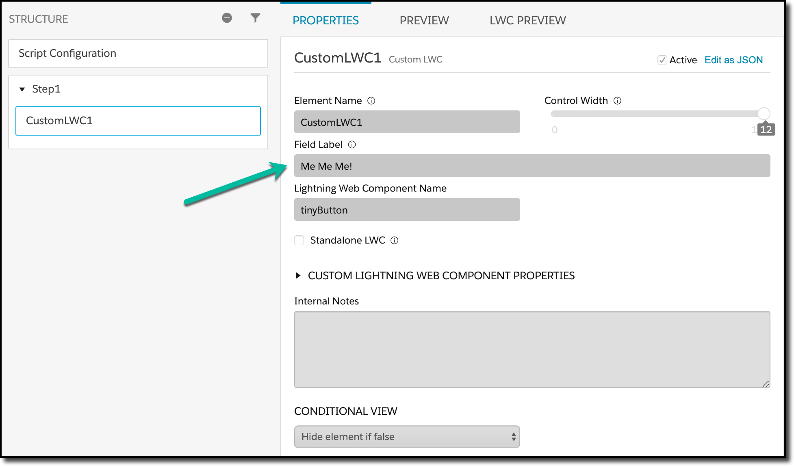
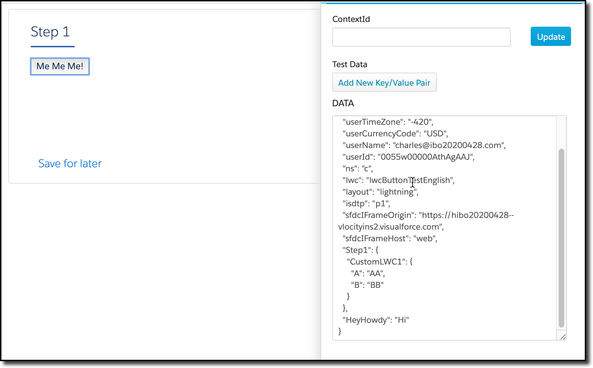

# OmniScript LWCs


## Tiny Button

This LWC has a small UI foot print and behaves somewhat like a set values.  It is intended mostly as a base to start building from, but gives you enough hooks to use as examples.

Here's an example of how it's been added to an OmniScript:



You can see the field label specified as Me Me Me!, and how it gets rendered in the UI:



This screenshot was taken after it was clicked, and you can see two elements have been set in the data JSON.  The first is Step1.CustomLWC1, and the second is HeyHowdy.  These were set in the handler for the on click event on the button:

```    javascript
handleClick(event) {
	//  Set the value of the button in the data JSON (without really knowing "who" I am)
  this.omniUpdateDataJson({"A": "AA", "B":"BB"});

	//  Set some values explicitly in the data JSON
  this.omniApplyCallResp({"HeyHowdy": "Hi"});
}
```


