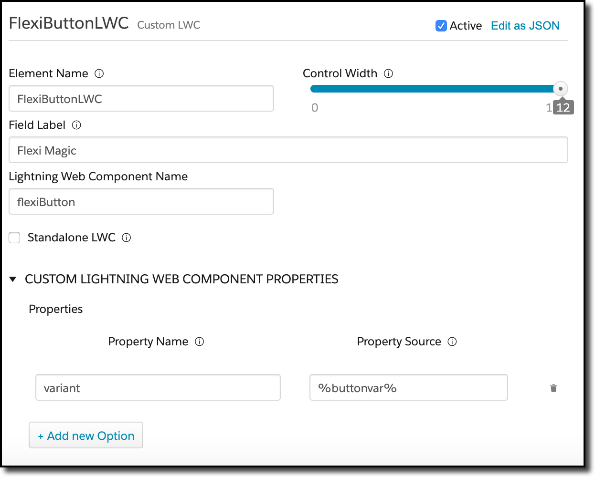
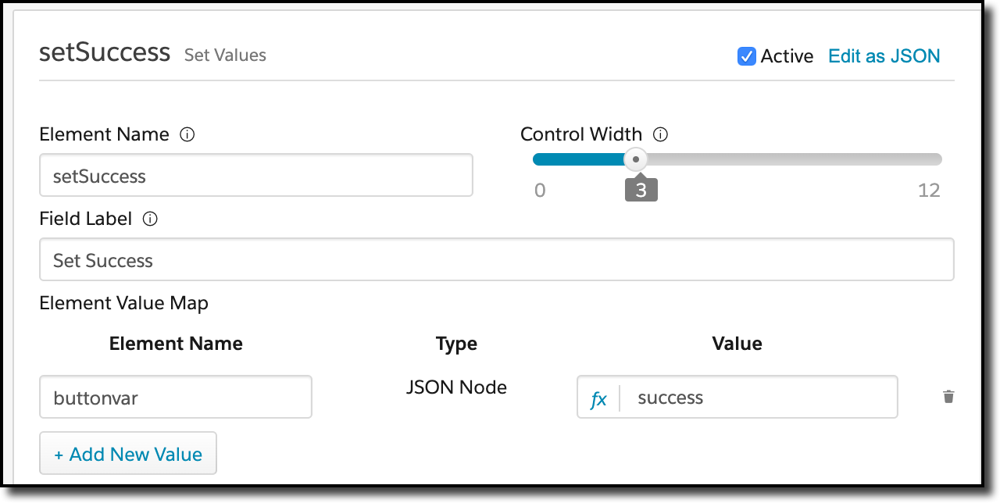
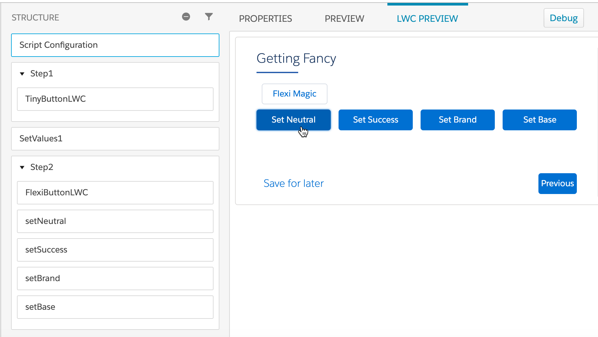

# Flexi Button

[This LWC](flexiButton) is similar to Tiny Button, except that it demonstrates how you can pass in custom properties into your control.  Custom properties are kind of interesting, in that you need to define an @api for each one that will be passed the value.

Here's how you configure custom properties in the OmniScript designer:



You can see the property source uses the % merge field syntax; this means the value that will be passed to the control will be not literally the string %buttonvar%, but the contents of that element.  We use that to dynamically control the appearance of the button at runtime in our OmniScript using a variety of set values that look similar to this:



This allows for some interesting (although probably useless in production) effects like this:



The template for the LWC uses properties from the .js file to control all aspects of its behavior:

```    html
<template>
    <lightning-button variant={buttonVariant} label={buttonLabel} title={buttonTitle} onclick={handleClick} class="slds-m-left_x-small"></lightning-button>
</template>
```

In order to get the value of the custom property, we have to use an @api setter (which is called every time we change the value, as well, which is how the above animation is able to work):

```javascript
     @api
     get variant() {
         return this.buttonVariant;
     }
     set variant(value) {
         this.buttonVariant = value;
     }
```

You can see the whole thing, of course, in the source code.

