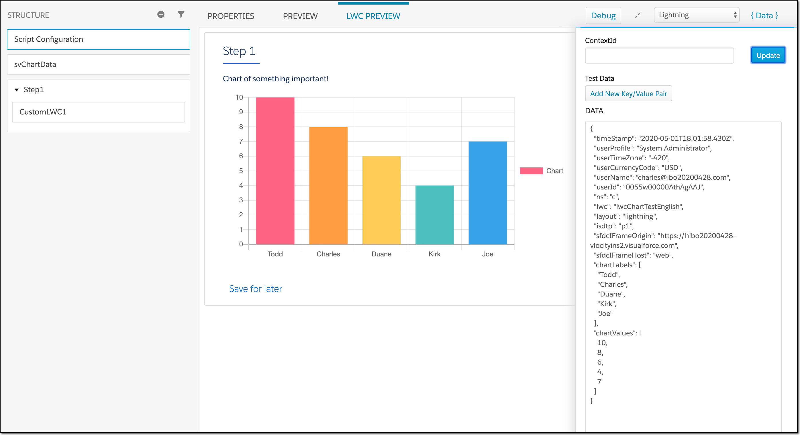
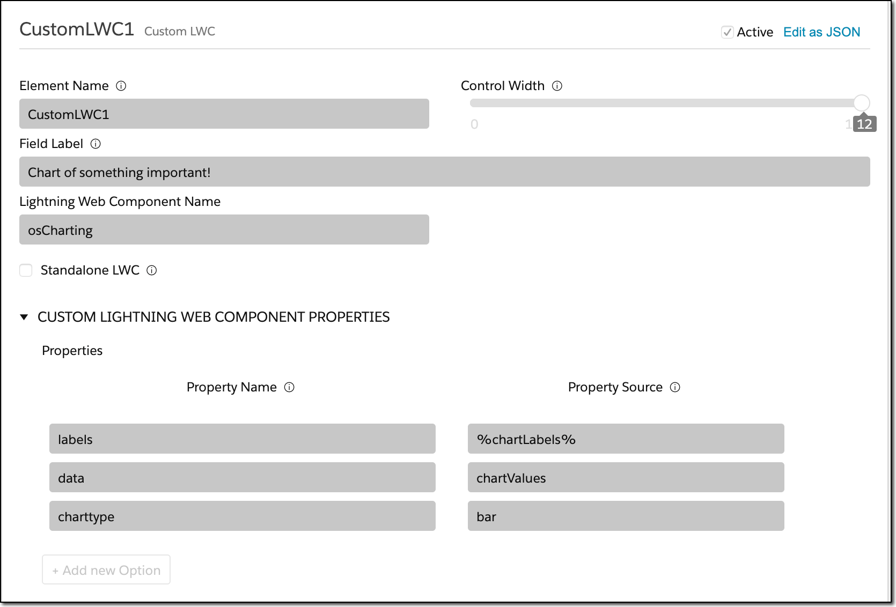
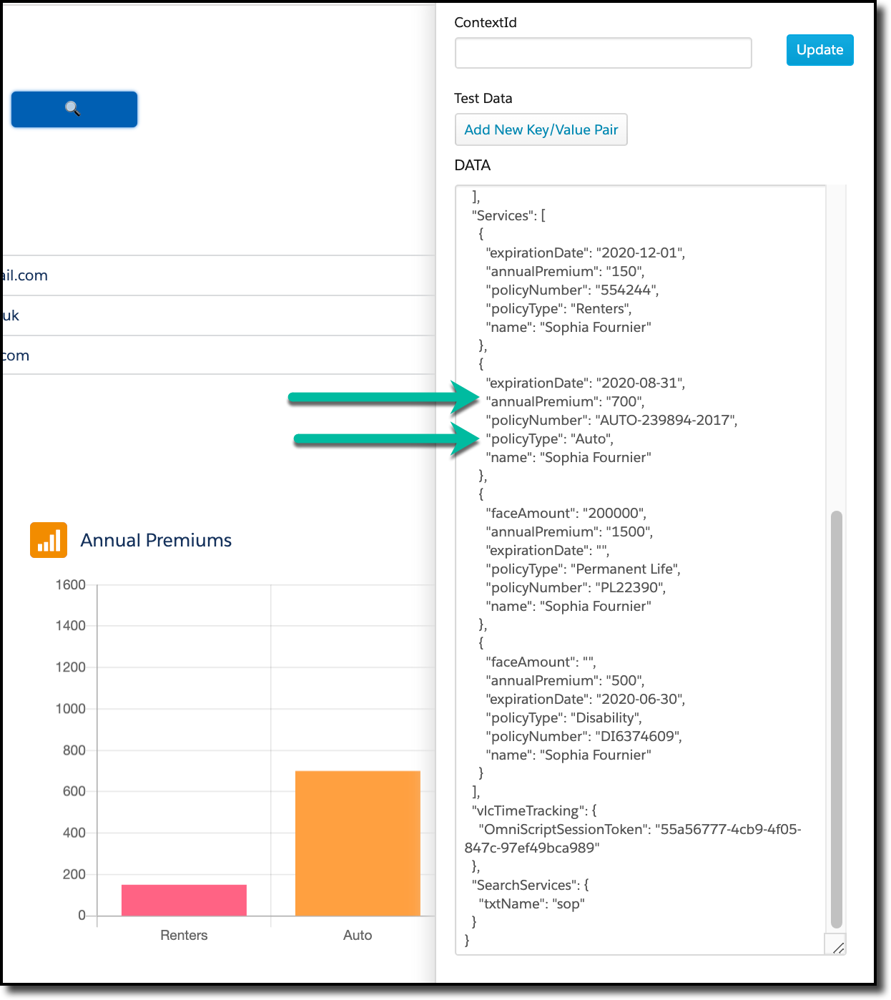

# OmniScript Charting

[This LWC](osCharting) provides a wrapper around ChartJS to allow the embedding of charts in OmniScripts:



This document covers two topics: how to use it (as-is), and how the code works.

## Using the LWC

The LWC is driven by custom parameters:



The field label is displayed above the chart, and the rest of the parameters are passed as custom properties.  The following properties are available:

| Parameter     | Usage                                                        |
| ------------- | ------------------------------------------------------------ |
| ChartType     | One of line, bar, radar, doughnut, pie, polarArea, bubble, scatt |
| Options       | A compelte set of options for ChartJS.  This is pretty complicated, and in the future I'll try to provide finer grained control. |
| Labels        | A %element-name% that points to the source of the elements   |
| LabelElement  | If Labels is an array of objects, the element in the objects with the label |
| Source        | The %name% of the element which holds the data to chart      |
| SourceElement | If the source is an array of objects, the element in the objects that holds the numerical data. |

In the above screenshots, data that had been returned from an Integration Procedure is being charted.  You can see how "Services" is structured as an array of objects, and each object has an "annualPremium" element with the column data and "policyType" with the label:




## Implementation Details

There's a couple of interesting details that can be easy to miss when you review the source code.

The actual charting library is held in a static resource called 'chartzip'.  As the name suggests, it is a zip file containing two members:

1. Chart.js: This is actually the file "Chart.bundle.min.js" from the distribution
2. Chart.css: This is actually the file "Chart.min.css" from the distribution.

As it turns out, the primary CDN for ChartJS does not hold the css file, and so I had to use the following repository as my source: https://www.jsdelivr.com/package/npm/chart.js?path=dist

I build the demo using version 2.9.3 of ChartJS.  Because that version tries to do CSS insertion and that is banned by Salesforce, we had to include the CSS file explicitly and turn off CSS Injection via the line of code:

```javascript
window.Chart.platform.disableCSSInjection = true;
```

Because the LWC is namespaced, it is very hard to actually reference static resources without generating an error; the normal approach is to use a URL of @salesforce/resourceURL/..., but that does not work.  Instead, we use a simple url of /resource/... like this:

```javascript
        let resourceUrl = "/resource/chartzip";
        Promise.all([
            loadScript(this, resourceUrl + "/Chart.js"),
            loadStyle(this, resourceUrl + "/Chart.css")
        ])
```

(Many thanks to Siddharth Buddhavarapu for providing that trick!)

I am told that in Vlocity version 108 there will be an API provided to do this, so this is a provisional implementation.


