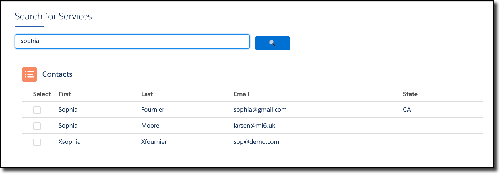
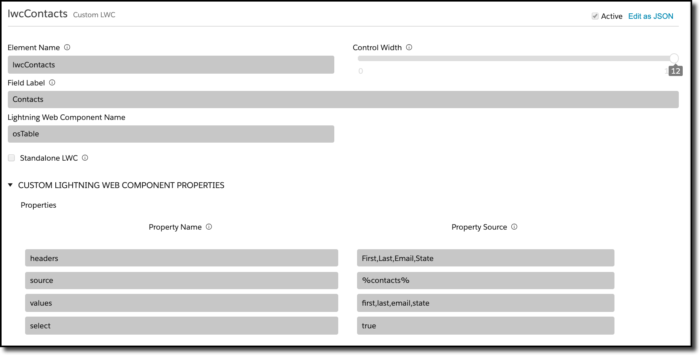
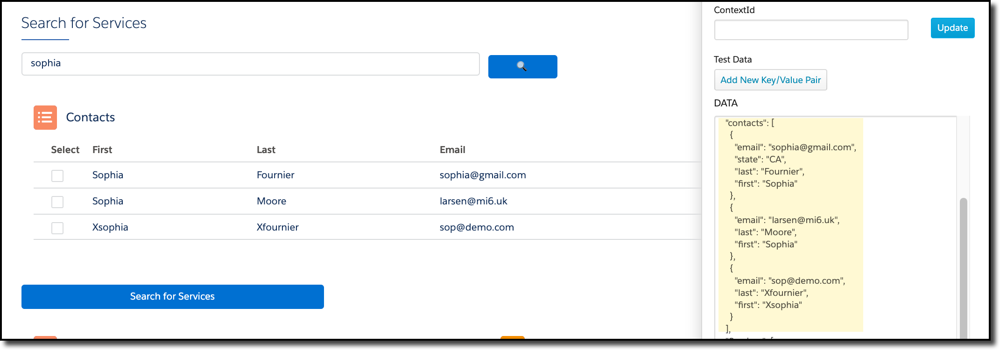

# OmniScript Tables

[This LWC](osTable) displays tabular data with an option to select rows, replacing, in some sense, the old Selectable Items control in OmniScript:

This document covers two topics: how to use it (as-is), and how the code works.

## Using the LWC

The LWC is driven by custom parameters:

The field label is displayed above the table, and the rest of the parameters are passed as custom properties.  The following properties are available:

| Parameter | Usage                                                        |
| --------- | ------------------------------------------------------------ |
| headers   | A comma separated list of the column headers, in the order they appeal |
| source    | A %element% that contains the data for the table (which is an array of javascript objects) |
| values    | A comma separated list of the element keys that are to be played out into the table, in the order that they should appear (and matching the headers, of course) |
| select    | true, if you want the first column to have check boxes and the value of the OS element to be the list of selected rows.  false, if you do not. |
| debug     | The level of debug messages to print on the Javascript console. 0 is for errors, 1 is for warnings, 2 for informational messages, and 3 is for a full dump. |
| iconName  | The name of the SLDS icon to display; defaults to "standard:lead_list" |

In the above screenshots, data that had been returned from a data raptor is being displayed.  The data looks likel:

## Implementation Details

The HTML layout uses the basic structure of a card, which consists of an icon and a title (from the OS element label) displayed above the table.  It uses SLDS table formatting, but not a data table, so that it's a bit more lightweight looking within an OmniScript.

