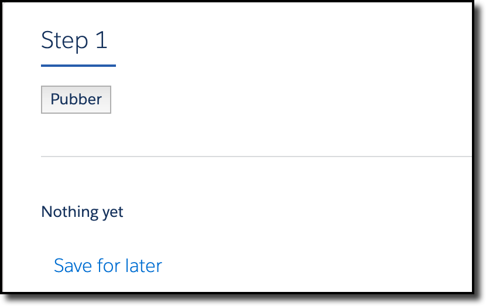
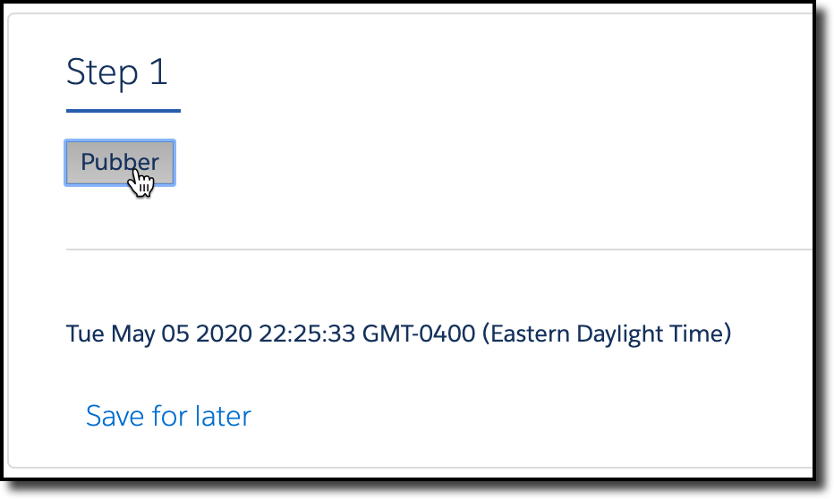
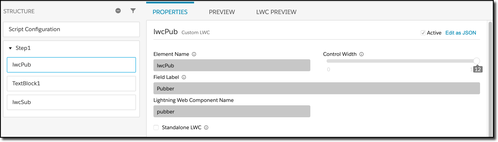

# PubSub

This is a simple example that shows a button that, when clicked, publishes a message that is received by a simple label.  This shows how two separate custom LWCs can communicate with each other inside of an OmniScript.

The UI design is simple.  There's a button, a horizontal line, and a label.  The button and the label are custom LWCs. 

 Click the button, and it sends the current date and time to the label:

## Components

There are three components that make up this demo:

* pubsub: This is a javascript only component that implements the publish and subscribe mechanism
* pubber: This is a variation of TinyButton that publishes the current date and time when the button is clicked.
* subber: This is a simple label that receives the date and updates a reactive property.

## Other Notes

The OmniScript which demonstrates this looks like this:

